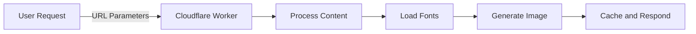

# Generate Dynamic OG Images using Cloudflare Workers

Social media thrives on compelling visuals. With Cloudflare Workers, you can effortlessly generate dynamic Open Graph (OG) images that grab attention and boost platform performance. In this tutorial, you’ll learn how to create a customizable OG image generator powered by serverless edge computing. Cloudflare Workers enable you to deliver blazing-fast visuals globally, ensuring a seamless experience for your users. Let’s dive in to see how you can take your OG images to the next level with Cloudflare Workers.

What you’ll accomplish:

    - Dynamically create stunning OG images using React and Tailwind CSS.
    - Optimize performance with built-in caching.
    - Customize visuals with flexible fonts and design options..

By the end, you’ll have a robust solution to enhance your social media presence.

GitHub repository: [og-image-generator-cloudflare-worker](https://github.com/mohdlatif/og-image-generator-cloudflare-worker)

## Why Use Cloudflare Workers?

Building OG image generators can be challenging, especially when it comes to ensuring global performance, scalability, and speed. This is where Cloudflare Workers excel:

    - Global Reach: Deliver your images with ultra-low latency, no matter where your users are located.
    - Serverless Simplicity: Focus on building features, not managing infrastructure.
    - Unparalleled Performance: Process and serve requests at the edge for blazing-fast load times.

By leveraging Cloudflare Workers, you get a serverless edge-computing environment that’s not only cost-efficient but also perfectly optimized for modern web applications.

## Workflow Overview

When a user requests an OG image, the following happens:

    Request Received: A URL with parameters is sent to a Cloudflare Worker.
    Content Processed: The Worker extracts text, style, and font configurations from the URL.
    Font Loaded: Fonts are retrieved using one of four methods, like Google Fonts or local files.
    Image Generated: The image is built using React components styled with Tailwind CSS.
    Response Cached: The final image is returned and cached for future requests.

Here’s how the process flows:



### Key Benefits

- **Edge Computing**: Generates images at the edge using Cloudflare Workers
- **Modern Rendering**: Utilizes Vercel's Satori library for high-quality image generation
- **Flexible Styling**: Supports both Tailwind CSS and inline styles
- **Font Versatility**: Multiple font loading strategies for different use cases
- **Performance Optimized**: Built-in caching and optimization
- **Customizable**: Easy to extend with new styles and font configurations
- **Developer Friendly**: TypeScript support and modular architecture

## Before you begin

Before you start, make sure you have:

- A Cloudflare account. If you do not have one, [sign up](https://dash.cloudflare.com/sign-up/workers-and-pages) before continuing.
- Wrangler CLI installed (`npm install -g wrangler`)
- [Bun](https://bun.sh/) installed on your machine.
- Basic familiarity with TypeScript and React.
- A text editor or IDE of your choice.

:::note

If you haven't installed Wrangler yet, you can do so using any of these package managers:

```bash

npm install -g wrangler

# or

bun add -g wrangler

# or

yarn global add wrangler

# or

pnpm add -g wrangler

```

:::

## 1. Set up your development environment

First, create a new Cloudflare Workers project using the Hono framework:

<PackageManagers
	type="create"
	pkg="cloudflare@latest"
	args="og-image-generator --template cloudflare-workers --pm bun"
/>

Navigate to the project directory:

```bash
cd og-image-generator
```

## 2. Install required dependencies

Add the necessary packages to your project:

<Tabs> <TabItem label="bun">

```sh
bun add @cloudflare/pages-plugin-vercel-og autoprefixer postcss-cli react react-dom tailwindcss
bun add -d @cloudflare/workers-types @types/bun @types/react @types/react-dom @vercel/og
```

</TabItem> <TabItem label="npm">

```sh
npm install @cloudflare/pages-plugin-vercel-og autoprefixer postcss-cli react react-dom tailwindcss
npm install -d @cloudflare/workers-types @types/bun @types/react @types/react-dom @vercel/og
```

</TabItem> <TabItem label="yarn">

```sh
yarn add @cloudflare/pages-plugin-vercel-og autoprefixer postcss-cli react react-dom tailwindcss
yarn add -d @cloudflare/workers-types @types/bun @types/react @types/react-dom @vercel/og
```

</TabItem> <TabItem label="pnpm">

```sh
pnpm add @cloudflare/pages-plugin-vercel-og autoprefixer postcss-cli react react-dom tailwindcss
pnpm add -d @cloudflare/workers-types @types/bun @types/react @types/react-dom @vercel/og
```

</TabItem> </Tabs>

## 3. Configure project settings

### Package.json configuration

Update your `package.json` to include the type module and deployment scripts:

```json:package.json

{

  "name": "og-image-generator",

  "module": "index.ts",

  "version": "1.0.0",

  "type": "module",

  "scripts": {

    "dev": "wrangler dev src/index.ts",

    "deploy": "wrangler deploy --minify src/index.ts"

  }

}

```

The `type: "module"` field enables ES modules support, and the `--minify` flag in the deploy script ensures your worker code is optimized for production.

### TypeScript configuration

Create a `tsconfig.json` file with the following configuration:

```json:tsconfig.json

{

  "compilerOptions": {

    "target": "ESNext",

    "lib": ["ESNext"],

    "moduleDetection": "force",

    "jsx": "react-jsx",

    "module": "ESNext",

    "moduleResolution": "bundler",

    "types": [

      "bun-types",

      "hono",

      "@cloudflare/workers-types/2023-07-01"

    ],

    "resolveJsonModule": true,

    "esModuleInterop": true,

    "allowJs": true,

    "checkJs": false,

    "noEmit": true,

    "isolatedModules": true,

    "allowSyntheticDefaultImports": true,

    "forceConsistentCasingInFileNames": true,

    "strict": true,

    "skipLibCheck": true,

    "noFallthroughCasesInSwitch": true,

    "noUnusedLocals": false,

    "noUnusedParameters": false,

    "noPropertyAccessFromIndexSignature": false

  },

  "baseUrl": "./",

  "paths": {

    "@/*": ["./src/*"]

  }

}

```

Key TypeScript configuration features:

- React JSX support with `jsx: "react-jsx"`
- ES modules configuration with `module: "ESNext"`
- Cloudflare Workers types integration
- Path aliases for cleaner imports
- Strict type checking enabled
- Modern JavaScript features support

### Configure Wrangler for Runtime Compatibility and Static Assets

Before starting, ensure your `wrangler.toml` includes these essential configurations:

```toml
compatibility_date = "2024-11-06"
compatibility_flags = [ "nodejs_compat_v2" ]
assets = { directory = "public",  binding = "ASSETS" }
minify = true
[build]
watch_dir = "public"
```

The `nodejs_compat_v2` flag enables runtime compatibility features required by the OG image generation library, even when using Bun. While we're using Bun as our development runtime, this flag ensures all necessary APIs are available in the Workers environment. The `assets` configuration maps your Worker's public directory, allowing direct access to static files like fonts, images, and favicons through URL paths (e.g., `/fonts/Inter.ttf`, `/images/logo.png`).

## 4. Configure font loading strategies

The generator supports four different font loading strategies, each with its own benefits:

1. **Google Fonts API** (Recommended for web fonts)

   - Best for: Popular web fonts with dynamic text
   - Pros: Optimized delivery, wide font selection
   - Cons: Requires internet connection

2. **GitHub-hosted fonts** (Alternative for Google Fonts)

   - Best for: Stable, version-controlled fonts
   - Pros: Direct access to font files
   - Cons: Manual updates needed

3. **Direct URL fonts** (For custom hosted fonts)

   - Best for: Self-hosted or third-party fonts
   - Pros: Complete control over font sources
   - Cons: Requires hosting infrastructure

4. **Local font files** (For offline/private fonts)
   - Best for: Custom or licensed fonts
   - Pros: No external dependencies
   - Cons: Increases worker bundle size

Choose your strategy based on:

- Font licensing requirements
- Performance needs
- Hosting preferences
- Update frequency

First, create a `fonts` directory inside your `public` folder to store any local font files:

```bash
mkdir -p public/fonts
```

This directory will store any font files (like `.ttf`, `.otf`) that you want to serve directly from your Worker.

Create a new file for handling different font loading methods:

```typescript

---

filename: src/getFonts.ts

---

// Example of Google Fonts loading strategy
export async function googleFont(
    text: string,
    font: string,
    weight: Weight = 400,
    style: Style = 'normal'
): Promise<{ data: ArrayBuffer; name: string; style: Style; weight: Weight }> {
    const fontFamilyFetchName = font.replace(/ /g, '+');
    const API = `https://fonts.googleapis.com/css2?family=${fontFamilyFetchName}:ital,wght@${
        style === 'italic' ? '1' : '0'
    },${weight}&text=${encodeURIComponent(text)}`;

    // Fetch the CSS containing the font URL
    const css = await (
        await fetch(API, {
            headers: {
                'User-Agent': 'Mozilla/5.0 ...' // User agent string
            },
        })
    ).text();

    // Extract the font file URL from the CSS
    const resource = css.match(/src: url\((.+)\) format\('(opentype|truetype)'\)/);
    if (!resource) {
        throw new Error('Failed to fetch font');
    }

    // Fetch and return the actual font data
    const res = await fetch(resource[1]);
    const data = await res.arrayBuffer();

    return { data, name: font, style, weight };
}

// ... other font loading strategies available in the full source code

```

:::note

The font loading system supports multiple strategies including Google Fonts, GitHub-hosted fonts, direct URL fonts, and local fonts. Choose the strategy that best fits your needs.

:::

## 5. Configure image loading

The generator supports loading images from your Worker's assets. Create an `images` directory inside your `public` folder to store any image files:

```bash
mkdir -p public/images
```

Create a new file for handling image loading:

```typescript

---

filename: src/loadImage.ts

---

import { Context } from 'hono';

export async function loadImage(c: Context, imagePath: string): Promise<string | null> {
  try {
    if (!c.env?.ASSETS) {
      throw new Error('ASSETS binding is not configured');
    }

    const imageUrl = new URL(imagePath, c.req.url).toString();
    const imageData = await c.env.ASSETS.fetch(imageUrl);

    // Get content-type from response
    const contentType = imageData.headers.get('content-type') || 'image/png';

    const arrayBuffer = await imageData.arrayBuffer();
    const base64Image = Buffer.from(arrayBuffer).toString('base64');
    return `data:${contentType};base64,${base64Image}`;
  } catch (error) {
    console.warn(`Failed to load image ${imagePath}:`, error);
    return null;
  }
}
```

This utility function:

- Loads images from your Worker's assets
- Automatically detects image content type
- Converts images to base64 for use in OG images
- Provides fallback handling if image loading fails

Use it in your templates like this:

```typescript
const logoImage = await loadImage(c, '/images/your-logo.png');
```

:::note
Make sure your images are stored in the `public/images` directory and referenced with paths starting with `/images/`.
:::

## 6. Implement the OG image generator

Create the main image generation handler:

```typescript

---

filename: src/og.tsx

---

import { Hono } from 'hono';

import { ImageResponse } from '@cloudflare/pages-plugin-vercel-og/api';


const app = new Hono();


export default app.get('/', async (c) => {

  const { mainText, description, footerText } = c.req.query();

  // Implementation details

});

```

## 7. Add visual styles

The OG image generator includes 4 distinct styles that can be selected via the `style` query parameter. The style selection is handled through a simple query parameter in the URL:

```typescript
style = 1; // Default professional style
style = 2; // Eco-tech theme
style = 3; // Corporate brand style
style = 4; // GitHub profile style
```

If no style parameter is provided or an invalid value is used, the generator defaults to Style1. Here's how to use each style:

### Style 1: Professional (Default)


```url
/og?style=1&mainText=Building%20the%20Future&description=Modern%20web%20development
```

Features:

- Blue gradient background
- Frosted glass card effect
- Perfect for blog posts and articles

### Style 2: Eco-Tech


```url
/og?style=2&mainText=Green%20Summit&description=Sustainable%20Innovation
```

Features:

- Green gradient theme
- Semi-transparent overlay
- Ideal for environmental or sustainability content

### Style 3: Corporate


```url
/og?style=3&mainText=Company%20Update&description=Q4%20Results
```

Features:

- Warm gradient background
- Logo integration
- Professional corporate layout

### Style 4: GitHub Profile


```url
/og?style=4
```

Features:

- Minimal design
- GitHub avatar integration
- Perfect for developer profiles

:::tip
You can combine any style with other parameters like `mainText`, `description`, and `footerText` to customize the output further.
:::

The style selection is implemented using a ternary chain in the code:

```typescript


---

filename: src/index.ts

---

const SocialCardTemplate =
    c.req.query('style') === '2'
        ? Style2()
        : c.req.query('style') === '3'
        ? Style3()
        : c.req.query('style') === '4'
        ? Style4()
        : Style1();
```

This implementation allows for easy addition of new styles in the future by simply adding new conditions to the chain and corresponding style components.

```typescript

---

filename: src/og.tsx

---

function Style1() {

  return (

    <div tw="flex flex-col w-full h-full p-12 bg-gradient-to-br from-blue-900 to-indigo-700">

      {/* Style implementation */}

    </div>

  );

}

```

## 8. Configure caching

Enable caching to:

- Reduce computation costs
- Improve response times
- Decrease origin server load
- Provide consistent performance

Here's how to implement caching with customizable durations:

```typescript

---

filename: src/index.ts

---

import { Hono } from 'hono';

import { cache } from 'hono/cache';


const app = new Hono()

  .use('*', cache({

    cacheName: async (c) => {

      const url = new URL(c.req.url);

      return `${c.req.method} ${url.pathname}${url.searchParams}`;

    },

    cacheControl: 'max-age=86400'

  }))

  .route('og', og);

```

:::caution

Make sure to configure appropriate cache durations based on your application's needs. The example uses a 24-hour cache duration.

:::

## 8. Deploy your Worker

Deploy the application to Cloudflare Workers:

```bash

bun run deploy

```

## Usage examples

Generate OG images by making GET requests:

https://your-worker.workers.dev/og?mainText=Hello%20World&description=A%20dynamic%20OG%20image&style=1

You can customize the image by adjusting query parameters:

- `mainText`: Main heading

- `description`: Detailed description

- `footerText`: Footer content

- `style`: Visual style (1-4)

## Conclusion

Congratulations! You’ve successfully harnessed the power of Cloudflare Workers to build a dynamic OG image generator. By leveraging the global edge network and serverless architecture, your application now delivers high-performance visuals with ease. Whether you’re scaling for millions of users or iterating on design tweaks, Cloudflare Workers ensure your images are always fast, reliable, and stunning.

This solution provides:

- Fast generation times through edge computing
- Multiple font loading options
- Pre-designed visual styles
- Built-in caching support

The complete source code is available on [GitHub](https://github.com/mohdlatif/og-image-generator-cloudflare-worker).

You have successfully created a dynamic OG image generator that runs at the edge. The application can now generate social media cards with:

## Related resources

- [Cloudflare Workers documentation](https://developers.cloudflare.com/workers/)

- [Hono framework](https://hono.dev/)

- [Vercel OG Image Generation](https://vercel.com/docs/functions/og-image-generation)

- [Cloudflare page plugin vercel/og](https://developers.cloudflare.com/pages/functions/plugins/vercel-og/)

- [Tailwind CSS](https://tailwindcss.com/)
